# 什么是 Neuro-Symbolic Machine?

传统计算机里的"计算", 通常意味着一段程序从入口开始执行, 经过一系列指令, 最终返回结果.

这种定义非常成功, 它塑造了函数/进程/线程/系统调用, 也塑造了我们今天绝大多数软件.

但当人工智能开始成为能够长期行动/使用工具/等待外部事件/修改自身策略并与其他智能体协作的实践主体时, 这种计算模型开始显得过于狭窄.

一次真正的智能活动可能持续数分钟, 也可能持续数月. 它可能经历模型推理/数据库查询/程序执行/人工确认/设备操作/节点迁移和策略修改. 它可能在等待期间处理其他工作, 也可能在新的证据出现之后重新推翻旧结论.

因此, 在 Neuro-Symbolic Machine 中, 我们需要重新回答一个基础问题：

> **什么是一条计算?**

## 计算不再等于一次函数调用

传统程序中的计算通常具有非常明确的形态：

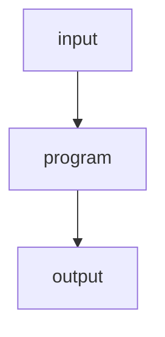

即使内部包含并发, I/O 或异步操作, 程序仍然通常围绕一次执行生命周期组织.

但一个 Agent 的工作往往不是这样.

设想一个研究任务：

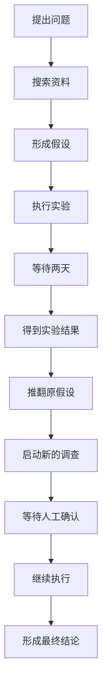

这显然是一条连续的"计算".

但它无法自然地表示成：

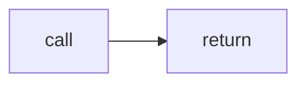

它跨越了时间/进程/机器, 甚至可能跨越程序版本.

因此, Neuro-Symbolic Machine 中的计算首先应该被理解为：

> **一个具有身份/目标/状态和历史的持续过程.**

计算本身必须成为一等对象.

```lisp
#<COMPUTATION
  :id investigation-42
  :goal ...
  :state :waiting
  :owner researcher-agent
  :history ...
  :continuation ...>
```

它不因为当前没有 CPU 正在执行它而停止存在.

等待, 本身也是计算的一种状态.

## 计算是一条持续的状态演化

可以把一条计算抽象为：

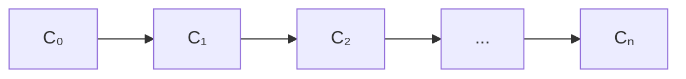

其中每个状态不仅包含程序局部变量, 还可能包含：

```text
目标
当前关注对象
已经接受的事实
候选假设
未完成的子计算
等待条件
已经产生的外部效果
可用能力
执行历史
```

因此一个计算状态更接近：

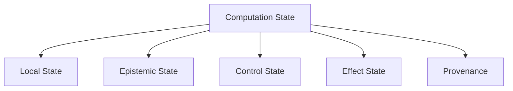

这与传统 continuation 有相似之处, 但范围更大.

传统 continuation 主要回答：

> 程序接下来从哪里继续执行?

Neuro-Symbolic Machine 中的 continuation 还需要回答：

- 当前为什么处于这里?
- 哪些外部动作已经发生?
- 哪些假设仍然成立?
- 哪些世界状态可能已经失效?
- 恢复之后哪些操作可以安全重试?

所以计算不是单纯的控制流.

它是一条具有因果连续性的实践过程.

## Neural 与 Symbolic 都只是计算的一部分

在很多 Agent 系统中, LLM 被放在整个系统的中心：

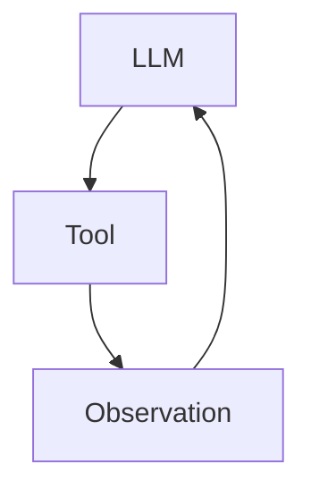

这种设计非常接近 ReAct, 也足以构造许多有用的 Agent.

但在 Neuro-Symbolic Machine 中, 我希望关系发生变化.

不是：

```text
LLM owns the computation
```

而是：

```text
Computation owns the interaction with the LLM
```

模型只是计算过程中可以调用的一种认知能力.

一条计算可能执行：

```text
symbolic query
neural inference
deterministic program
constraint solving
external effect
human interaction
waiting
```

它们都是同一级别的计算步骤.

例如：

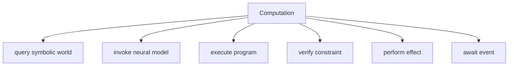

Neural 与 Symbolic 因此不再是两个彼此连接的"模块".

它们是同一条计算中不同性质的操作.

## Symbolic World 不是工具, 而是计算发生的环境

如果只是让模型偶尔调用：

```text
query-knowledge-graph()
```

或者：

```text
run-symbolic-solver()
```

那么 Symbolic 仍然只是 Tool.

这还没有真正改变计算模型.

在 Neuro-Symbolic Machine 中, Symbolic World 应该成为计算持续存在的环境.

计算可以围绕一组稳定对象进行：

```lisp
#<TASK task-42>
#<AGENT researcher>
#<HYPOTHESIS h-17>
#<DOCUMENT paper-3>
#<EXPERIMENT exp-8>
```

模型/程序和人类看到的不是互相独立的文本副本, 而是同一批具有身份的对象.

于是：

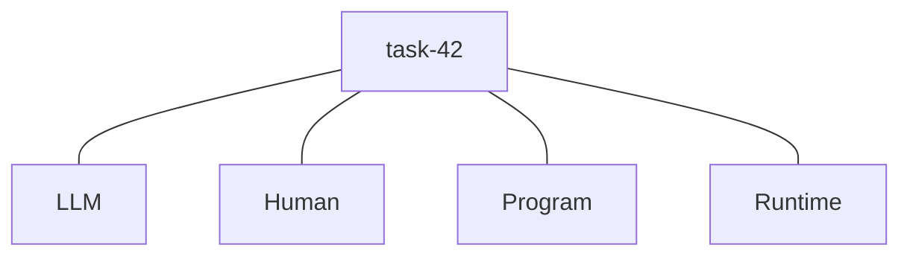

它们引用的是同一个逻辑实体.

这使"上下文"从一串临时 token, 变成一个持续存在的对象世界.

## 计算需要区分事实与假设

Neural Model 的一个基本特点是, 它非常擅长提出候选解释.

但候选解释不等于事实.

因此一条 Neuro-Symbolic Computation 不能简单地把模型输出直接写入 Symbolic World.

系统至少需要区分：

```text
Observation
Hypothesis
Derived Fact
Verified Fact
Decision
Effect
```

例如：

```lisp
(hypothesis
  :proposition '(overloaded node-b)
  :confidence 0.64
  :evidence (...))
```

和：

```lisp
(observation
  :proposition '(cpu-load node-b 0.97)
  :source monitor-21
  :time ...)
```

不是一回事.

计算可以：

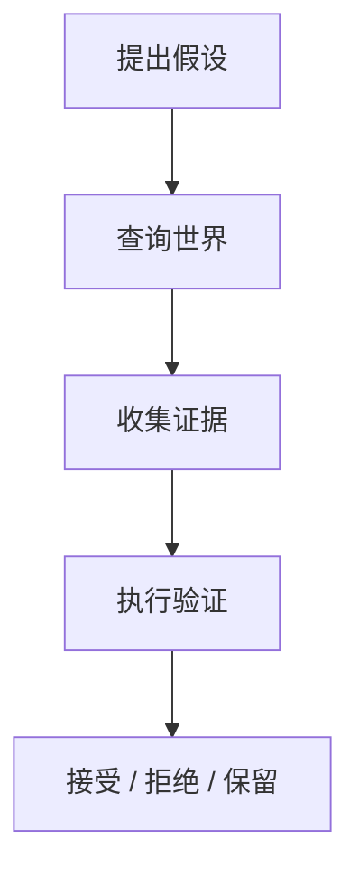

因此"思考"不再只是模型内部不可见的 token 过程.

其中一部分可以被外化为持久的 epistemic objects.

## Cognitive Workspace

这意味着 Symbolic World 之外还需要一个更临时的空间.

我称它为：

> **Cognitive Workspace**

它用于承载：

```text
假设
候选计划
反事实
临时解释
搜索分支
尚未验证的结构
```

可以把整个系统理解为：

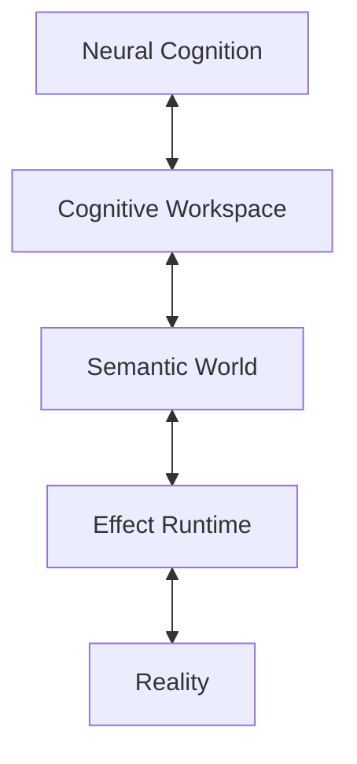

Neural Cognition 可以自由地产生模糊和不确定的结构.

但只有经过验证/提交或明确标记之后, 它们才进入更稳定的 Semantic World.

这种关系有些类似数据库事务：

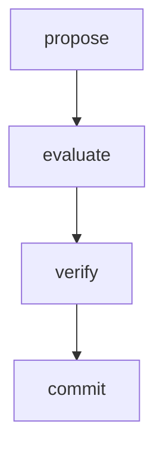

只是这里被提交的不是普通数据, 而是对世界的认识.

## 一条计算包含"认知"也包含"实践"

传统程序主要改变机器内部状态.

Agent 的计算则必须真正改变外部世界.

例如：

```text
发送邮件
修改文件
创建订单
移动机器人
部署服务
启动实验
```

这些动作不能被当成普通函数.

因为：

```text
(send-email ...)
```

和：

```text
(+ 1 2)
```

具有完全不同的语义.

前者可能：

```text
不可逆
需要权限
可能失败
可能重复执行
需要审计
需要等待外部确认
```

所以 Neuro-Symbolic Machine 中应该存在明确的：

> **Effect**

```lisp
#<EFFECT
  :operation send-message
  :target alice
  :status :committed
  :caused-by computation-42>
```

计算并不直接"修改世界".

它提出 effect, Runtime 检查：

```text
capability
constraint
policy
current state
```

然后决定：

```text
execute
reject
simulate
wait
```

这使 Neural Agent 的开放式能力与系统的确定性边界可以共存.

## Capability 是计算能够行动的边界

如果 Agent 可以修改自身程序, 同时又可以任意调用外部资源, 那么自我演化很快就会变成权限失控.

所以计算必须明确知道：

> **它可以做什么.**

Capability 应该成为计算状态的一部分.

例如：

```lisp
#<CAPABILITY
  :operation deploy
  :scope staging
  :holder computation-42
  :expires ...>
```

模型可以发现：

```text
我想部署 production
```

但 Runtime 可以确定：

```text
当前计算只有 staging capability
```

于是：

```text
intent ≠ authority
```

这是 Neuro-Symbolic Machine 中非常重要的一条原则.

Neural Model 可以自由地产生目标和方案.

但它不能通过"想象自己拥有权限"而获得权限.

## Computation 应该是 Durable 的

如果计算是持续实践过程, 那么：

```text
process crash
machine reboot
network partition
software upgrade
node migration
```

都不应该天然意味着计算死亡.

因此, 计算必须拥有 durable semantics.

例如：

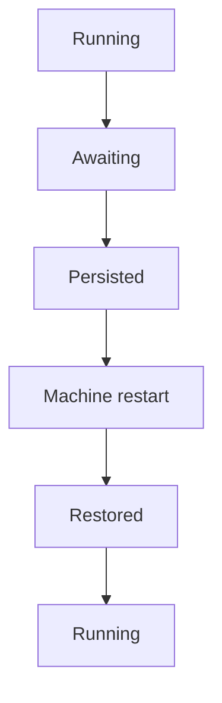

甚至：

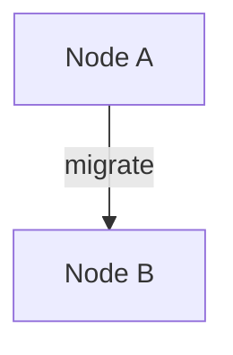

计算的逻辑身份都不改变.

这要求 Runtime 维护的不只是：

```text
memory snapshot
```

而是：

```text
logical state
effect history
continuation
version
ownership
pending events
```

空间上的分布与时间上的恢复, 本质上是同一个问题：

> **计算的逻辑身份不能等同于当前执行位置.**

## Agent 不是计算

这一点值得明确.

Agent 与 Computation 不应该是同一个概念.

一个 Agent 可以同时拥有多条计算：

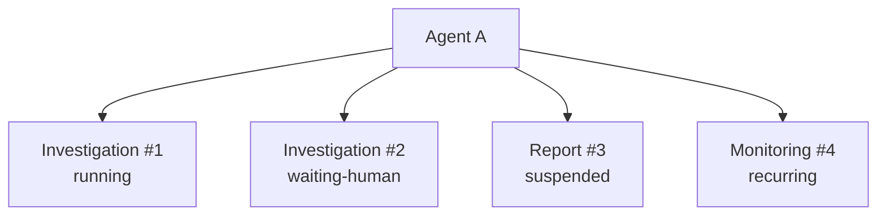

这些计算可以共享某些长期知识和策略, 但各自拥有独立的局部状态.

所以可以把 Agent 理解成：

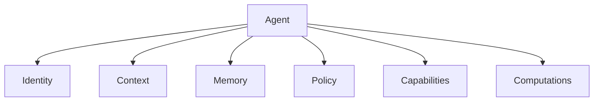

而一条 Computation 是：

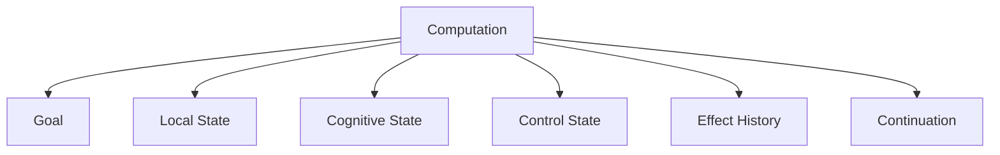

这一区分非常重要.

否则 Agent 很容易再次退化成：

```text
one mailbox
one loop
one conversation
```

无法表达真正长期/并发/可暂停的智能活动.

## 计算可以产生新的计算

当模型发现问题可以拆分时, 它可以产生：

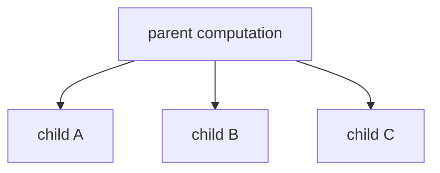

这些子计算可能：

```text
并行运行
迁移到其他节点
交给其他 Agent
等待不同事件
```

因此 computation graph 应该是一等结构.

例如：

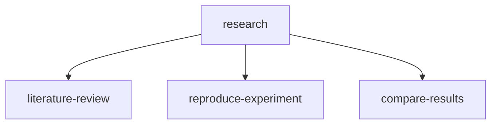

其中任意节点都可能继续展开.

这时"workflow"不再是外部编排文件.

它是运行中的 computational object graph.

模型可以检查和修改它.

人也可以检查和修改它.

## 程序也只是计算的一种结晶

传统观念中：

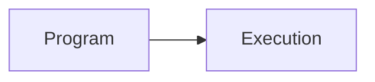

程序在前, 执行在后.

Neuro-Symbolic Machine 中, 两者关系可能更动态.

模型第一次遇到一个问题时, 可能进行：

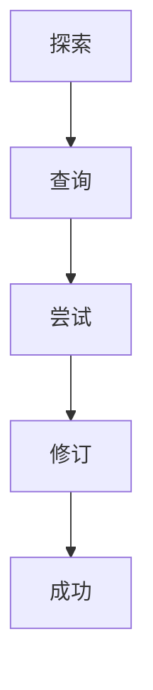

经过多次类似经验后, 系统发现：

```text
这个模式值得复用.
```

于是产生：

```lisp
(defskill recover-overloaded-task (...)
  ...)
```

也就是说：

```mermaid
flowchart TD
    history["Computation History"] --> program["Reusable Program"]
```

程序可以被理解成：

> **被压缩/稳定化的计算经验.**

这正是 Neural 与 Symbolic 能够互补的关键.

## Symbolic Crystallization

我把这个过程称为：

> **Symbolic Crystallization**

```mermaid
flowchart TD
    exploration["Neural exploration"] --> trajectory["successful trajectory"]
    trajectory --> pattern["pattern discovery"]
    pattern --> hypothesis["symbolic hypothesis"]
    hypothesis --> evaluation["evaluation"]
    evaluation --> reusable["reusable skill / rule / program"]
```

于是第一次解决问题时：

```text
需要模型大量推理
```

后来：

```text
只需要调用已有 symbolic skill
```

这使智能系统不仅"记住答案", 还可以把经验转化成新的计算结构.

## 反方向则是 Neuralization

Symbolic 也不应该无限增长.

如果某种模式已经拥有大量稳定轨迹：

```text
Skill
Skill
Skill
Skill
...
```

它们可以重新成为：

```text
training data
```

并通过：

```text
fine-tuning
distillation
reinforcement learning
```

进入 Neural Model.

因此：

```mermaid
flowchart LR
    neural["Neural"] -->|crystallization| symbolic["Symbolic"]
    symbolic -->|neuralization| neural
```

两者之间形成双向流动.

这也是为什么 Neuro-Symbolic Machine 不应被理解成：

```text
LLM + Symbolic Solver
```

而应该被理解成：

> **允许知识在 neural/symbolic/programmatic representation 之间持续迁移的机器.**

## 学习不是一种操作

从这个角度看, "学习"至少有三种完全不同的形式.

```mermaid
flowchart TD
    experience["Experience"] --> memory["Memory"]
    experience --> skill["Skill / Program"]
    experience --> weights["Neural Weights"]
```

它们分别对应：

```text
记住
程序化
神经化
```

一个系统学会新知识, 不一定要训练模型.

一次新的经验首先可能只是：

```text
新增一条事实.
```

反复出现的经验可能变成：

```text
新的规则或程序.
```

只有更长期/更普遍的模式才可能值得进入：

```text
模型参数.
```

因此：

> **Learning is movement between representations.**

这是 Neuro-Symbolic Machine 与单纯"大模型 + Memory"非常不同的一点.

## Runtime 负责维持因果连续性

如果 Agent 可以：

```text
重试
恢复
迁移
并发
修改策略
```

那么系统最容易失去的是因果关系.

例如：

```text
为什么这封邮件发送了两次?

为什么这个结论依赖已经失效的实验?

为什么恢复之后又重新执行了一次支付?

为什么这个 Agent 获得了这个能力?
```

所以 Runtime 必须维护：

```text
Identity
Causality
Provenance
Version
Effect History
```

一条计算的历史不是 debug log.

它本身就是计算的组成部分.

```mermaid
flowchart TD
    c0["C₀"] --> observation["Observation O₁"]
    c0 --> hypothesis["Hypothesis H₁"]
    c0 --> query["Query Q₁"]
    c0 --> effect["Effect E₁"]
    c0 --> result["Result R₁"]
    result --> c1["C₁"]
```

这使系统能够：

```text
inspect
explain
replay
audit
rollback
learn
```

## 一条计算也可以被另一个计算理解

传统程序执行之后, 通常只留下结果和日志.

Neuro-Symbolic Machine 中, 一条计算本身应该是可查询对象.

例如：

```lisp
(describe computation-42)

(explain computation-42)

(dependencies-of computation-42)

(effects-of computation-42)

(fork computation-42)
```

另一个 Agent 可以检查：

```text
它做过什么?
依据是什么?
现在等待什么?
还有哪些候选分支?
```

然后继续接手.

这使 computation 第一次成为真正的协作对象.

## 人类也生活在同一套计算世界里

如果计算具有结构化身份/状态与历史, 那么人类不应该只能通过聊天框观察它.

人可以直接进入这套计算世界.

例如一个正在运行的调查可能呈现为：

```text
Investigation #42

Goal:
    Diagnose repeated failures

Current state:
    waiting for experiment-7

Hypotheses:
    H1: node overload      0.71
    H2: network failure   0.18

Subcomputations:
    log-analysis      completed
    experiment-7      waiting

Available actions:
    inspect
    fork
    cancel
    approve experiment
```

LLM 看到的是同一批对象.

程序看到的也是同一批对象.

Human/Neural Model 和传统程序因此不是通过三套独立接口交互.

它们进入的是同一个 Semantic World.

## 从 Instruction Set 到 Practice Set

传统机器的基本动作是：

```text
load
store
jump
call
return
```

高级语言再将这些动作组合成程序.

如果 Neuro-Symbolic Machine 真的形成自己的计算模型, 它可能需要另一组更高层的 primitive：

```text
observe
hypothesize
query
verify
propose
await
fork
effect
commit
invalidate
resume
learn
```

这些未必最终都成为 VM instruction.

但它们更接近智能实践真正反复出现的基本动作.

传统计算机擅长回答：

> 如何执行程序?

Neuro-Symbolic Machine 更需要回答：

> 如何让一个持续存在的智能主体认识世界/采取行动/保存经验并改变自己的方法?

## 一个可能的定义

因此, 我目前更愿意这样定义 Neuro-Symbolic Machine 中的 Computation：

> **A computation is a durable, causally continuous process that transforms semantic state through neural judgement, symbolic operations, and verified effects.**

中文可以表达为：

> **计算是一条持久的/保持因果连续性的实践过程, 它通过神经判断/符号运算与受验证的现实作用不断改变语义状态.**

其中：

```text
durable
```

意味着它不依赖一次进程生命周期.

```text
causally continuous
```

意味着它能够解释自己如何来到当前状态.

```text
semantic state
```

意味着它操作的不是只有 bytes, 而是有身份和关系的对象.

```text
neural judgement
```

负责处理开放性/不确定性和语义理解.

```text
symbolic operations
```

负责确定性的查询/计算/约束和复用.

```text
verified effects
```

负责真正改变现实, 并维护权限与执行语义.

## Machine 的意义

这样看来, Neuro-Symbolic Machine 的目标并不是做一个更复杂的 Agent Framework.

它试图改变的是：

> **计算机究竟为谁/以什么方式组织计算.**

传统计算机主要为程序提供：

```text
CPU
Memory
File
Process
Network
```

Neuro-Symbolic Machine 则可能进一步提供：

```text
Entity
Fact
Computation
Capability
Effect
History
```

传统 OS 使程序能够长期使用硬件.

Neuro-Symbolic Machine 希望使智能活动能够长期存在于世界中.

如果未来的 AI 不再只是一个回答问题的模型, 而是一个能够持续学习/实践/协作和改变自身工作方式的主体, 那么它所需要的也许不再只是：

```text
Prompt
Context
Tool
```

而是一台真正为这种智能活动设计的机器.

计算, 也就不再只是指令执行.

它会重新变成一种更加原始的东西：

> **一个主体持续认识和改变世界的过程.**
